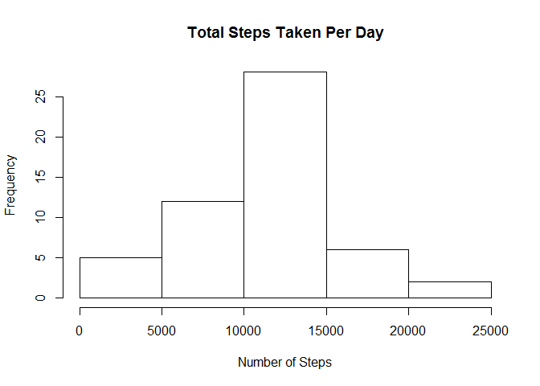

# Reproducible Research: Peer Assessment 1
Good R Grains  
# Personal Activity During Weekdays and Weekends

This report analyzes a set of personal activity monitoring data to answer the question: "Are there any differences in activity during the week compared to during the weekend"

## Loading and preprocessing the data
The data is from a personal activity monitoring device that collected data from an anonymous individual collected during October and November 2012. The data include the number of steps taken in 5 minute intervals each day.

The first step is to load the necessary libraries and read in the data.

```r
library(lattice)
steps_data<-read.csv("E:\\data\\activity.csv")
```
The variables included in the dataset are:
* Steps
* Date
* Interval identifier

## Analyze data for daily information
### Mean total number of steps taken per day

First step is to determine the total number of steps taken per day and plot the results in a histogram. Then find the mean and median daily number of steps.

```r
steps_daily_total<-aggregate(x=steps_data$steps, by=list(steps_data$date), FUN="sum")

hist(steps_daily_total$x, 
      main = "Total Steps Taken Per Day", 
      xlab="Number of Steps", 
      ylab ="Frequency")
```

\

```r
steps_daily_mean<-mean(steps_daily_total$x, na.rm=TRUE)
steps_daily_median<-median(steps_daily_total$x, na.rm=TRUE)
print(paste("The mean daily number of steps is", steps_daily_mean))
```

```
## [1] "The mean daily number of steps is 10766.1886792453"
```

```r
print(paste("The median daily number of steps is", steps_daily_median))
```

```
## [1] "The median daily number of steps is 10765"
```
### Average daily activity pattern

Next, average the intervals across all days, and plot the results. Then determine which interval has the maximum of steps taken, on average.

```r
steps_interval_mean<-aggregate(x=steps_data$steps, by=list(steps_data$interval), FUN="mean", na.rm=TRUE)
plot(steps_interval_mean$Group.1, steps_interval_mean$x,  type='l', 
      main = "Mean Steps Taken Per Interval", 
      xlab="Interval (5 minutes)", 
      ylab ="Number of Steps")
```

\

```r
max_interval<-steps_interval_mean$Group.1[steps_interval_mean$x==max(steps_interval_mean$x)]
print(paste("The interval with the maximum average number of steps is interval", max_interval))
```

```
## [1] "The interval with the maximum average number of steps is interval 835"
```
## Inputing missing values
Want to compare the above results with data that has the missing data filled in with the overall average steps per interval. Plot the results and find the mean and median with the missing data filled in.

```r
missing_values<-sum(is.na(steps_data$steps))
print(paste("The number of intervals missing values in the dataset is", missing_values))
```

```
## [1] "The number of intervals missing values in the dataset is 2304"
```

```r
steps_interval_mean_overall<-steps_daily_mean/(length(steps_data$interval)/length(steps_daily_total$Group.1))
new_steps_data<-steps_data
new_steps_data$steps[is.na(new_steps_data$steps)] = (steps_interval_mean_overall)

new_steps_daily_total<-aggregate(x=new_steps_data$steps, by=list(new_steps_data$date), FUN="sum")

hist(new_steps_daily_total$x, 
      main = "Total Steps Taken Per Day with NA Replaced", 
      xlab="Number of Steps", 
      ylab ="Frequency")
```

\

```r
new_steps_daily_mean<-mean(new_steps_daily_total$x)
new_steps_daily_median<-median(new_steps_daily_total$x)
print(paste("The mean daily number of steps after inputting daily average for missing values is", new_steps_daily_mean))
```

```
## [1] "The mean daily number of steps after inputting daily average for missing values is 10766.1886792453"
```

```r
print(paste("The median daily number of steps after inputting daily average for missing values is", new_steps_daily_median))
```

```
## [1] "The median daily number of steps after inputting daily average for missing values is 10766.1886792453"
```
Comparing these to the earlier mean and median that took the mean and median with ignoring the missing values, we can see that there is very little difference made by filling in the values.

## Determine if there differences in activity patterns between weekdays and weekends
The last analysis we are going to run on the data is to compare activity during the weekdays and compare to activity on weekend days. After indentifying the weekend and weekdays, separate the data, find the mean number of steps per interval, and plot the results in a panel of two time series plots.

```r
new_steps_data$date<-as.Date(new_steps_data$date)
weekday<-c("Monday","Tuesday","Wednesday","Thursday","Friday")

new_steps_data$day <- factor((weekdays(new_steps_data$date) %in% weekday), levels=c(FALSE, TRUE), labels=c('weekend', 'weekday'))
weekday_steps<-subset(new_steps_data, day=="weekday")
weekend_steps<-subset(new_steps_data, day=="weekend")
weekday_steps_interval_mean<-aggregate(x=weekday_steps$steps, by=list(weekday_steps$interval, weekday_steps$day), FUN="mean")
weekend_steps_interval_mean<-aggregate(x=weekend_steps$steps, by=list(weekend_steps$interval, weekend_steps$day), FUN="mean")
new_steps_data<-rbind(weekend_steps_interval_mean, weekday_steps_interval_mean)

xyplot(x~Group.1|Group.2, data=new_steps_data, type='l', layout = c(1,2),
  main ="Average Steps per Interval",
  xlab = "Interval (5 minutes)",
  ylab = "Number of Steps, Average")
```

\

From the plots it can be seen that there are differences in weekday versus weekend activity. Examples of differences would include a later time to marked non-activity, i.e. sleeping, and a later time to the start of activity, time when waking up. The person also appears to do a more rigourous workout early in the day on weekdays, and has more consistant activity during the day on weekends. Therefore we conclude there are differences in weekday and weekend activities.
